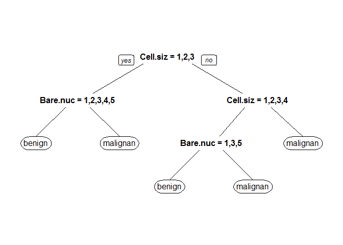

乳癌預測模型
================

資料前處理
----------

### 資料讀取

此資料來源為UCI Machine Learning Repository。

``` r
if (!require('mlbench')){
    install.packages("mlbench")
}
 
 library(mlbench)
 data(BreastCancer)
 head(BreastCancer)
```

    ##        Id Cl.thickness Cell.size Cell.shape Marg.adhesion Epith.c.size
    ## 1 1000025            5         1          1             1            2
    ## 2 1002945            5         4          4             5            7
    ## 3 1015425            3         1          1             1            2
    ## 4 1016277            6         8          8             1            3
    ## 5 1017023            4         1          1             3            2
    ## 6 1017122            8        10         10             8            7
    ##   Bare.nuclei Bl.cromatin Normal.nucleoli Mitoses     Class
    ## 1           1           3               1       1    benign
    ## 2          10           3               2       1    benign
    ## 3           2           3               1       1    benign
    ## 4           4           3               7       1    benign
    ## 5           1           3               1       1    benign
    ## 6          10           9               7       1 malignant

``` r
 BreastCancerC<-BreastCancer[complete.cases(BreastCancer),!names(BreastCancer)%in%c("Id")]
 c(nrow(BreastCancer),nrow(BreastCancerC))
```

    ## [1] 699 683

### 將資料隨機分為訓練組與測試組

隨機將2/3的資料分到訓練組（Test==F），剩下1/3為測試組（Test==T）

``` r
 BreastCancerC$Test<-F
 BreastCancerC[sample(1:nrow(BreastCancerC),nrow(BreastCancerC)/3),]$Test<-T
 c(sum(BreastCancerC$Test==F),sum(BreastCancerC$Test==T))
```

    ## [1] 456 227

可得訓練組案例數為456 測試組案例數為227

預測模型建立
------------

### 模型建立

由於變數較少，而輸出為二元類別變項，故選擇決策樹建立模型。

``` r
if (!require('rpart')){
    install.packages("rpart")
  library(rpart)
}
if(!require('rpart.plot')){
 install.packages("rpart.plot");
  library(rpart.plot)
}
 
 fit<-rpart(Class~.,data=BreastCancerC[BreastCancerC$Test==F,])
 fit
```

    ## n= 456 
    ## 
    ## node), split, n, loss, yval, (yprob)
    ##       * denotes terminal node
    ## 
    ##  1) root 456 155 benign (0.66008772 0.33991228)  
    ##    2) Cell.size=1,2,3 312  20 benign (0.93589744 0.06410256)  
    ##      4) Bare.nuclei=1,2,3,4,5 297   7 benign (0.97643098 0.02356902) *
    ##      5) Bare.nuclei=6,7,8,9,10 15   2 malignant (0.13333333 0.86666667) *
    ##    3) Cell.size=4,5,6,7,8,9,10 144   9 malignant (0.06250000 0.93750000)  
    ##      6) Cell.size=1,2,3,4 26   7 malignant (0.26923077 0.73076923)  
    ##       12) Bare.nuclei=1,3,5 8   2 benign (0.75000000 0.25000000) *
    ##       13) Bare.nuclei=4,7,8,9,10 18   1 malignant (0.05555556 0.94444444) *
    ##      7) Cell.size=5,6,7,8,9,10 118   2 malignant (0.01694915 0.98305085) *

``` r
 prp(fit)
```

<!-- -->

### 模型說明

由上述可大略推測參數數值大小與乳癌發生情況。
